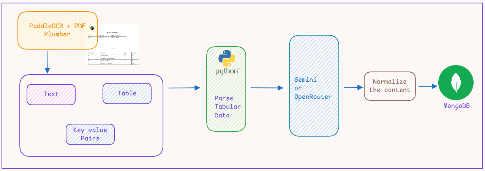

# End-to-End Generative AI Supply Chain Document Processing Application


This is an end-to-end Generative AI project focused on supply chain document processing. The application ingests unstructured documents — PDFs and scanned images — and converts them into clean, structured data stored in MongoDB Atlas.

Originally, developed for a client with `Azure Document Intelligence` and `Azure OpenAI`, but for demo purpose switche to `PaddleOCR` and `PDF Plumber` and some parts are omitted.

## System Architecture




## Use Case

Designed for small-to-medium organisations that handle large volumes of supply chain documents — Purchase Orders, Invoices, Delivery Notes — arriving as PDFs or scanned images.

The core problem: converting these documents into structured database records typically requires manual data entry. That process is slow, error-prone, and resource-intensive.

This application automates the full pipeline: 
```
extract → parse → normalise → store
```

## Pipeline Steps

### 1. Document Extraction — pdfplumber + PaddleOCR

The first stage reads the raw document and pulls out all text and table content.

**pdfplumber** handles native PDFs:
- Extracts full page text
- Extracts tables as structured row/column data
- Preserves cell positions with `row_index` and `column_index`

**PaddleOCR** acts as the fallback for image-based or scanned PDFs:
- Runs OCR with angle classification enabled
- Returns text lines with confidence scores
- Triggered automatically when pdfplumber returns no text content

The extraction output is a consistent dictionary:

```python
{
    "text": "...",          # Full document text
    "tables": [...]         # List of tables, each a list of cell dicts
}
```

---

### 2. Deterministic Table Parsing — Custom Python Module

Raw extraction output is noisy. The `parse_tables` module cleans and restructures it before handing off to AI.

This step handles:
- Stripping index columns and empty rows
- Mapping column indices to header names
- Casting values to the correct Python types (`int`, `float`, `str`)
- Separating order-level metadata from line-item product rows

Output is a clean, typed Python dict matching the expected document schema — no AI involvement at this stage keeps it fast, deterministic, and cheap.

---

### 3. AI Normalisation — Google Gemini + OpenRouter

Even after deterministic parsing, field names and values from real-world documents rarely match the target schema perfectly. A field labelled `Product` in the source document needs to map to `product_name` in the database. Dates may be formatted inconsistently. Unit prices may include currency symbols.

AI normalisation handles this gap with a two-tier setup:

**Primary: Google Gemini**
- Receives the parsed data and raw OCR text as context
- Instructed via a system prompt to return only valid JSON matching the target schema
- Configured with `response_mime_type: application/json` for structured output
- Temperature set low to reduce hallucination risk

**Fallback: OpenRouter**
- Triggered automatically if Gemini fails or is unavailable
- Routes to open-source models (e.g. Mistral, LLaMA) via the OpenRouter API
- Uses the same prompt and schema
- Includes a `clean_json_response` helper to strip markdown wrappers that some OSS models add

If both providers fail, the pipeline returns the deterministically parsed data rather than dropping the record.

---

### 4. Storage — MongoDB Atlas

Normalised documents are written to MongoDB Atlas, the cloud-hosted version of MongoDB.

MongoDB's document model suits this use case well: each purchase order can contain a variable number of line items (`products` array), and that variable structure maps naturally to a BSON document without requiring schema migrations.

Each stored record includes:
- `source_file` — the original filename for traceability
- `data` — the normalised document payload
- `created_at` — UTC timestamp of ingestion

## Technology Stack

| Component | Technology |
|---|---|
| PDF extraction | `pdfplumber` |
| OCR (image/scanned PDFs) | `PaddleOCR` |
| AI normalisation (primary) | Google Gemini via `google-genai` |
| AI normalisation (fallback) | OpenRouter via `openai` client |
| Database | MongoDB Atlas (cloud) |
| Configuration | `config.yml` + `.env` |
| Package manager | `uv` |

---

## Key Design Decisions

**Layered extraction** — pdfplumber first, PaddleOCR as fallback. This avoids unnecessary OCR costs on native PDFs while still handling scanned documents.

**Deterministic parsing before AI** — cleaning and structuring the raw data before sending it to an LLM reduces token usage, improves reliability, and keeps the AI focused on normalisation rather than parsing.

**Primary + fallback AI** — Gemini is the first choice for its native JSON output mode. OpenRouter provides resilience without tying the application to a single provider.

**MongoDB Atlas** — cloud-hosted, no infrastructure to manage, and the flexible document model handles variable-length product lists without schema changes.
## Setup Instructions

### 1. Create a Virtual Environment
To isolate dependencies and ensure a clean environment, create a virtual environment using the following steps:

#### Windows:
```cmd
uv venv
```

#### macOS/Linux:
```bash
uv venv
```

### 2. Activate the Virtual Environment

#### Windows:
```cmd
.venv\Scripts\activate
```

#### macOS/Linux:
```bash
source .venv/bin/activate
```

### 3. Install Dependencies
Once the virtual environment is activated, install the required dependencies:
```bash
uv sync
```

### 4. Set Up Environment Variables
Create a `.env` file in the root directory of the project and add the necessary environment variables. Document extraction runs locally via pdfplumber and PaddleOCR — no cloud OCR keys required. Below is a sample `.env` file:

```
# Google Gemini API (AI normalization — primary)
GEMINI_API_KEY=your_gemini_api_key_here

# OpenRouter (AI normalization — fallback)
OPENROUTER_API_KEY=your_openrouter_api_key_here

# MongoDB
MONGO_CONNECTION_STRING=mongodb://your_mongo_connection_string
MONGO_DB_NAME=your_database_name
MONGO_COLLECTION_NAME=your_collection_name
```

### 5. Run the Project
To start the application, run the following command:
```bash
uv run python app.py
```

### 6. Run Tests
```
# Verbose output (shows each test name)
uv run pytest tests/ -v

# Short traceback on failures
uv run pytest tests/ -v --tb=short

# Run only unit tests (fast, no I/O)
uv run pytest tests/unit/ -v

# Run only property tests
uv run pytest tests/unit/test_properties.py -v

# Run only FastAPI endpoint tests
uv run pytest tests/integration/test_endpoints.py -v

# Run only real-file integration tests
uv run pytest tests/integration/test_real_files.py -v

# Skip OCR-dependent tests explicitly
uv run pytest tests/ -v -m "not integration"
```

## Notes
- Ensure Python is installed on your system. Use Python 3.7 or higher for compatibility.
- If you encounter any issues, verify that all dependencies are installed and the `.env` file is correctly configured.

## Future Improvements

The template becomes worth following if you expect to grow the project significantly — for example, adding support for multiple document schemas, different AI providers per document type, or a retrieval layer on top of the ingested data. At that point, splitting doc_processing.py into processing/ (pdfplumber/OCR extraction) and ai/ (normalization) would make sense.